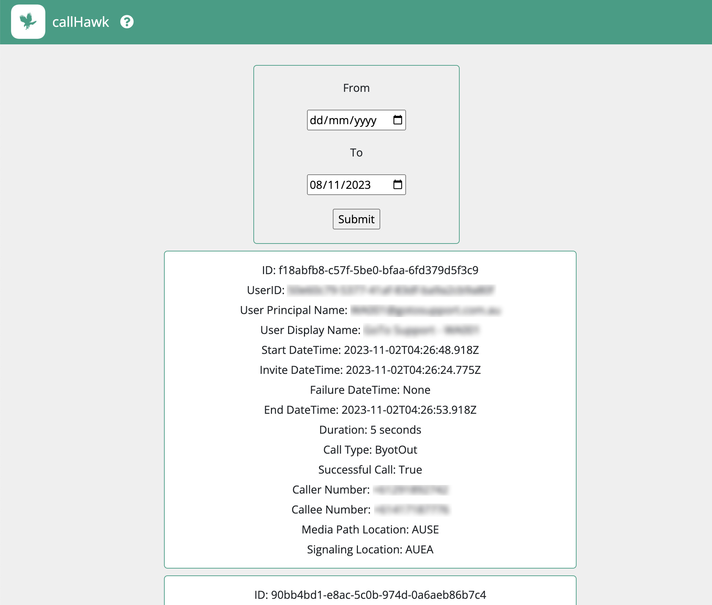

# callHawk

## Overview
callHawk is a light-weight tool to provide on-demand access to call records for defined users of Microsoft Teams with direct routing.
This is useful when people-managers need access to call records for a subset of operators in an organisation. 

callHawk would typically sit behind a reverse-proxy providing auth and TLS.

## Requirements
Create a new app registration in EntraID (formally known as AzureAD) and provide the credentials as environment variables

#### client_id
EntraID `clientID`

#### client_secret 
EntraID `clientSecret`

#### tenant_id
EntraID `tenant ID`

#### allowed_ObjectIDs
provide EntraID user Object IDs in the format of `"XXXXXXXX-XXXX-XXXX-XXXX-XXXXXXXXXXXX","XXXXXXXX-XXXX-XXXX-XXXX-XXXXXXXXXXXX"`

## Deployment
### Clone the repo
`git clone https://github.com/brentonbaker/callHawk`

`cd callHawk`

### Configuration
Create an `.env` file according to the requirements section above

### Build and launch
Run the following command to build and start callHawk

`docker-compose up -d`

### Verify deployment
Browse to `http://your-ip:8000`

